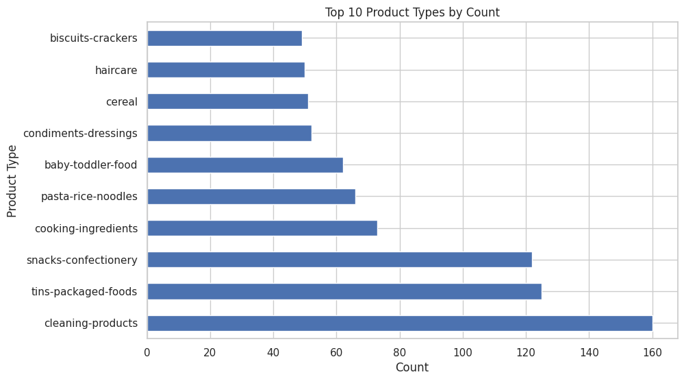
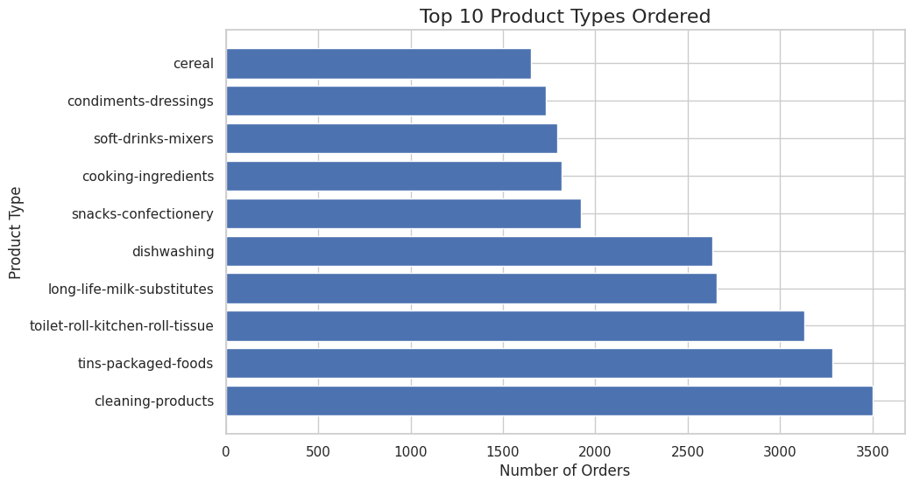
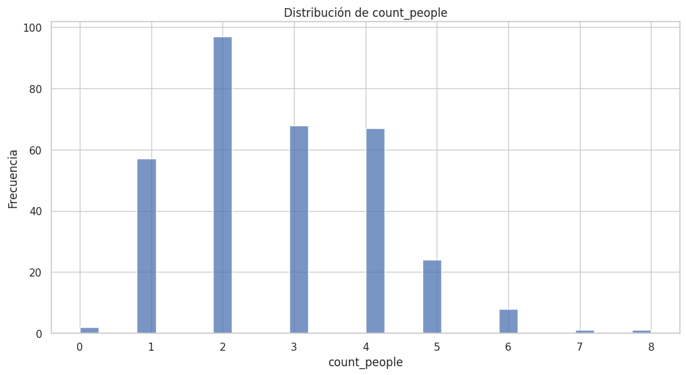
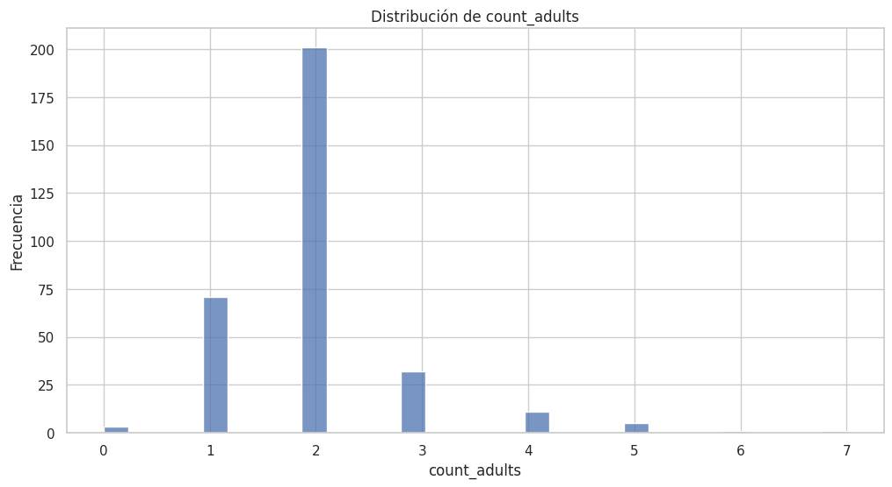
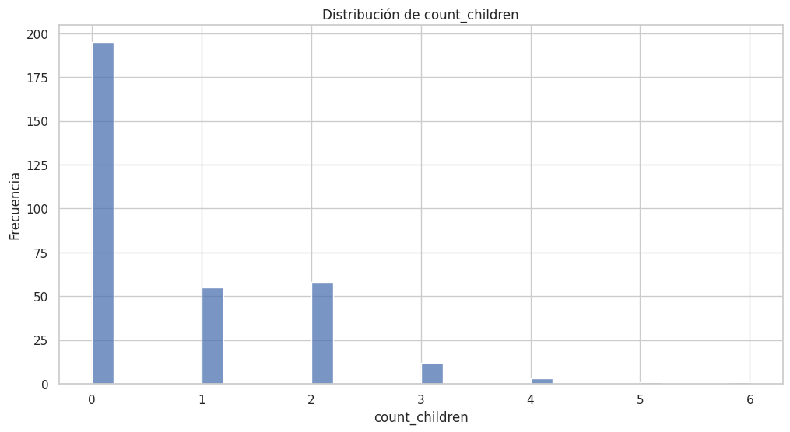
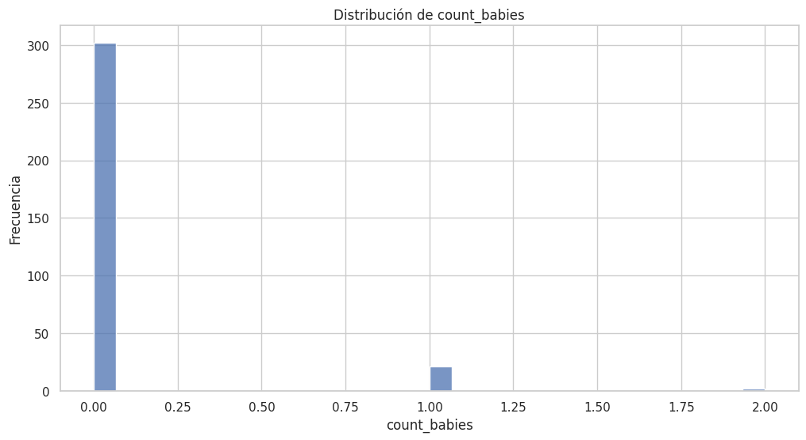
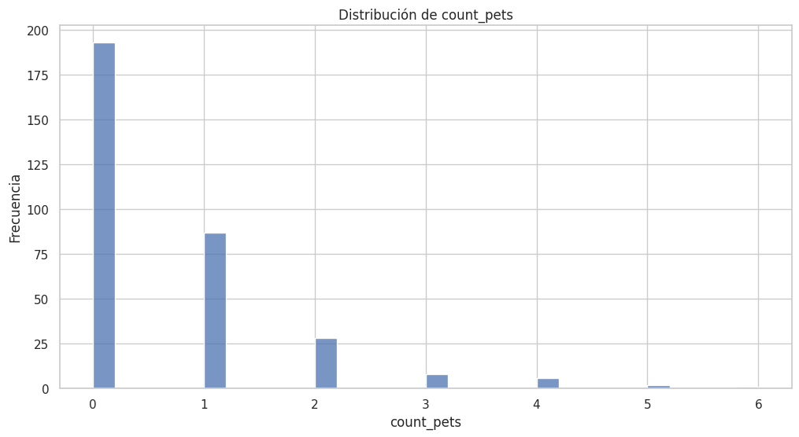

```python
import pandas as pd
import seaborn as sns
import matplotlib.pyplot as plt

abandoned_carts_df = pd.read_parquet("Data/abandoned_carts.parquet")

print(abandoned_carts_df.shape)
print(abandoned_carts_df.head())
print(abandoned_carts_df.info())
```

    (5457, 4)
                    id                                            user_id  \
    0   12858560217220  5c4e5953f13ddc3bc9659a3453356155e5efe4739d7a2b...   
    13  20352449839236  9d6187545c005d39e44d0456d87790db18611d7c7379bd...   
    45  20478401413252  e83fb0273d70c37a2968fee107113698fd4f389c442c0b...   
    50  20481783103620  10c42e10e530284b7c7c50f3a23a98726d5747b8128084...   
    52  20485321687172  d9989439524b3f6fc4f41686d043f315fb408b954d6153...   
    
                created_at                                         variant_id  
    0  2020-05-20 13:53:24  [33826459287684, 33826457616516, 3366719212762...  
    13 2021-06-27 05:24:13  [34415988179076, 34037940158596, 3450282236326...  
    45 2021-07-18 08:23:49  [34543001337988, 34037939372164, 3411360609088...  
    50 2021-07-18 21:29:36  [33667268116612, 34037940224132, 3443605520397...  
    52 2021-07-19 12:17:05   [33667268083844, 34284950454404, 33973246886020]  
    <class 'pandas.core.frame.DataFrame'>
    Index: 5457 entries, 0 to 70050
    Data columns (total 4 columns):
     #   Column      Non-Null Count  Dtype         
    ---  ------      --------------  -----         
     0   id          5457 non-null   int64         
     1   user_id     5457 non-null   object        
     2   created_at  5457 non-null   datetime64[us]
     3   variant_id  5457 non-null   object        
    dtypes: datetime64[us](1), int64(1), object(2)
    memory usage: 213.2+ KB
    None


```python
inventory_df = pd.read_parquet("Data/inventory.parquet")

print(inventory_df.shape)
print(inventory_df.head())
print(inventory_df.info())
```

    (1733, 6)
           variant_id  price  compare_at_price          vendor  \
    0  39587297165444   3.09              3.15           heinz   
    1  34370361229444   4.99              5.50   whogivesacrap   
    2  34284951863428   3.69              3.99          plenty   
    3  33667283583108   1.79              1.99  thecheekypanda   
    4  33803537973380   1.99              2.09         colgate   
    
                          product_type                                        tags  
    0             condiments-dressings                       [table-sauces, vegan]  
    1  toilet-roll-kitchen-roll-tissue                 [b-corp, eco, toilet-rolls]  
    2  toilet-roll-kitchen-roll-tissue                              [kitchen-roll]  
    3  toilet-roll-kitchen-roll-tissue  [b-corp, cruelty-free, eco, tissue, vegan]  
    4                           dental                        [dental-accessories]  
    <class 'pandas.core.frame.DataFrame'>
    RangeIndex: 1733 entries, 0 to 1732
    Data columns (total 6 columns):
     #   Column            Non-Null Count  Dtype  
    ---  ------            --------------  -----  
     0   variant_id        1733 non-null   int64  
     1   price             1733 non-null   float64
     2   compare_at_price  1733 non-null   float64
     3   vendor            1733 non-null   object 
     4   product_type      1733 non-null   object 
     5   tags              1733 non-null   object 
    dtypes: float64(2), int64(1), object(3)
    memory usage: 81.4+ KB
    None


```python
product_type_counts = inventory_df["product_type"].value_counts()
product_type_counts.head(10).plot(kind="barh", figsize=(10, 6))
plt.title("Top 10 Product Types by Count")
plt.xlabel("Count")
plt.ylabel("Product Type")
plt.show()
```


    

    


```python
orders_df = pd.read_parquet("Data/orders.parquet")

print(orders_df.shape)
print(orders_df.head())
print(orders_df.info())
```

    (8773, 6)
                   id                                            user_id  \
    10  2204073066628  62e271062eb827e411bd73941178d29b022f5f2de9d37f...   
    20  2204707520644  bf591c887c46d5d3513142b6a855dd7ffb9cc00697f6f5...   
    21  2204838822020  329f08c66abb51f8c0b8a9526670da2d94c0c6eef06700...   
    34  2208967852164  f6451fce7b1c58d0effbe37fcb4e67b718193562766470...   
    49  2215889436804  68e872ff888303bff58ec56a3a986f77ddebdbe5c279e7...   
    
                created_at order_date  user_order_seq  \
    10 2020-04-30 14:32:19 2020-04-30               1   
    20 2020-04-30 17:39:00 2020-04-30               1   
    21 2020-04-30 18:12:30 2020-04-30               1   
    34 2020-05-01 19:44:11 2020-05-01               1   
    49 2020-05-03 21:56:14 2020-05-03               1   
    
                                            ordered_items  
    10  [33618849693828, 33618860179588, 3361887404045...  
    20  [33618835243140, 33618835964036, 3361886244058...  
    21  [33618891145348, 33618893570180, 3361889766618...  
    34  [33618830196868, 33618846580868, 3361891234624...  
    49  [33667166699652, 33667166699652, 3366717122163...  
    <class 'pandas.core.frame.DataFrame'>
    Index: 8773 entries, 10 to 64538
    Data columns (total 6 columns):
     #   Column          Non-Null Count  Dtype         
    ---  ------          --------------  -----         
     0   id              8773 non-null   int64         
     1   user_id         8773 non-null   object        
     2   created_at      8773 non-null   datetime64[us]
     3   order_date      8773 non-null   datetime64[us]
     4   user_order_seq  8773 non-null   int64         
     5   ordered_items   8773 non-null   object        
    dtypes: datetime64[us](2), int64(2), object(2)
    memory usage: 479.8+ KB
    None


```python
orders_exploded = orders_df.explode("ordered_items")
orders_exploded["ordered_items"] = orders_exploded["ordered_items"].astype(int)

inventory_df = inventory_df.rename(columns={"variant_id": "ordered_items"})

merged_df = orders_exploded.join(
    inventory_df.set_index("ordered_items"), on="ordered_items"
)

print(merged_df.head())

merged_df_no_duplicates = merged_df.drop_duplicates(subset=["id", "product_type"])

top_ordered_products = merged_df_no_duplicates["product_type"].value_counts()

print(top_ordered_products)
```

                   id                                            user_id  \
    10  2204073066628  62e271062eb827e411bd73941178d29b022f5f2de9d37f...   
    10  2204073066628  62e271062eb827e411bd73941178d29b022f5f2de9d37f...   
    10  2204073066628  62e271062eb827e411bd73941178d29b022f5f2de9d37f...   
    10  2204073066628  62e271062eb827e411bd73941178d29b022f5f2de9d37f...   
    10  2204073066628  62e271062eb827e411bd73941178d29b022f5f2de9d37f...   
    
                created_at order_date  user_order_seq   ordered_items  price  \
    10 2020-04-30 14:32:19 2020-04-30               1  33618849693828    NaN   
    10 2020-04-30 14:32:19 2020-04-30               1  33618860179588    NaN   
    10 2020-04-30 14:32:19 2020-04-30               1  33618874040452    NaN   
    10 2020-04-30 14:32:19 2020-04-30               1  33618907005060    NaN   
    10 2020-04-30 14:32:19 2020-04-30               1  33618907005060    NaN   
    
        compare_at_price vendor product_type tags  
    10               NaN    NaN          NaN  NaN  
    10               NaN    NaN          NaN  NaN  
    10               NaN    NaN          NaN  NaN  
    10               NaN    NaN          NaN  NaN  
    10               NaN    NaN          NaN  NaN  
    product_type
    cleaning-products                  3500
    tins-packaged-foods                3281
    toilet-roll-kitchen-roll-tissue    3131
    long-life-milk-substitutes         2657
    dishwashing                        2632
    snacks-confectionery               1920
    cooking-ingredients                1817
    soft-drinks-mixers                 1793
    condiments-dressings               1732
    cereal                             1653
    fabric-softener-freshener          1625
    dental                             1480
    cooking-sauces                     1476
    spreads                            1408
    pasta-rice-noodles                 1404
    hand-soap-sanitisers               1393
    biscuits-crackers                  1198
    home-baking                        1030
    washing-liquid-gel                 1018
    haircare                            890
    tea                                 888
    bin-bags                            827
    washing-capsules                    807
    skincare                            789
    washing-powder                      781
    bath-shower-gel                     767
    food-bags-cling-film-foil           650
    period-care                         536
    beer                                512
    baby-kids-toiletries                506
    delicates-stain-remover             497
    coffee                              475
    cat-food                            443
    wine                                419
    dog-food                            384
    spirits-liqueurs                    365
    deodorant                           252
    baby-toddler-food                   216
    baby-accessories                    201
    drying-ironing                      186
    nappies-nappy-pants                 171
    shaving-grooming                    169
    pet-care                            168
    baby-milk-formula                   159
    cider                               151
    superfoods-supplements              132
    household-sundries                  117
    medicines-treatments                 82
    water-softener                       73
    other-hot-drinks                     51
    low-no-alcohol                       42
    sexual-health                        36
    suncare                              32
    maternity                            30
    premixed-cocktails                   28
    medicine-treatments                  23
    adult-incontinence                   18
    mixed-bundles                         2
    Name: count, dtype: int64


En las órdenes no queda claro cuáles son los productos más vendidos, por lo que he decidido realizar un join entre las órdenes y el inventario. De esta forma, es posible identificar con mayor precisión los productos más vendidos. Al hacer el join, se puede observar que algunas columnas del dataframe de inventario contienen valores NaN, lo que indica que hay órdenes cuyos productos no están presentes en el inventario.


```python
plt.figure(figsize=(10, 6))
plt.barh(top_ordered_products.head(10).index, top_ordered_products.head(10).values)

plt.title("Top 10 Product Types Ordered", fontsize=16)
plt.xlabel("Number of Orders", fontsize=12)
plt.ylabel("Product Type", fontsize=12)

plt.show()
```


    

    


```python
merged_df_no_duplicates = merged_df.drop_duplicates(subset=["id", "product_type"])

top_ordered_products = merged_df_no_duplicates["vendor"].value_counts()
```


```python
regulars_df = pd.read_parquet("Data/regulars.parquet")

print(regulars_df.shape)
print(regulars_df.head())
print(regulars_df.info())
```

    (18105, 3)
                                                  user_id      variant_id  \
    3   68e872ff888303bff58ec56a3a986f77ddebdbe5c279e7...  33618848088196   
    11  aed88fc0b004270a62ff1fe4b94141f6b1db1496dbb0c0...  33667178659972   
    18  68e872ff888303bff58ec56a3a986f77ddebdbe5c279e7...  33619009208452   
    46  aed88fc0b004270a62ff1fe4b94141f6b1db1496dbb0c0...  33667305373828   
    47  4594e99557113d5a1c5b59bf31b8704aafe5c7bd180b32...  33667247341700   
    
                created_at  
    3  2020-04-30 15:07:03  
    11 2020-05-05 23:34:35  
    18 2020-04-30 15:07:03  
    46 2020-05-05 23:34:35  
    47 2020-05-06 14:42:11  
    <class 'pandas.core.frame.DataFrame'>
    Index: 18105 entries, 3 to 37720
    Data columns (total 3 columns):
     #   Column      Non-Null Count  Dtype         
    ---  ------      --------------  -----         
     0   user_id     18105 non-null  object        
     1   variant_id  18105 non-null  int64         
     2   created_at  18105 non-null  datetime64[us]
    dtypes: datetime64[us](1), int64(1), object(1)
    memory usage: 565.8+ KB
    None


```python
inventory_df = pd.read_parquet("Data/inventory.parquet")

regulars_with_product_type_df = regulars_df.join(
    inventory_df.set_index("variant_id"), on="variant_id", how="left"
).dropna()

top_product_type = regulars_with_product_type_df["product_type"].value_counts()

print(top_product_type.head(5))
```

    product_type
    cleaning-products                  1877
    tins-packaged-foods                1402
    dishwashing                         834
    toilet-roll-kitchen-roll-tissue     802
    cooking-ingredients                 784
    Name: count, dtype: int64


```python
top_vendor = regulars_with_product_type_df["vendor"].value_counts()
print(top_vendor.head(5))
```

    vendor
    ecover    837
    method    708
    biona     659
    oatly     356
    fairy     308
    Name: count, dtype: int64


```python
regulars_with_product_type_df = regulars_df.join(
    inventory_df.set_index("variant_id"), on="variant_id", how="left"
).dropna()

top_saved_variants = regulars_with_product_type_df.groupby("variant_id")[
    "user_id"
].nunique()

top_saved_variants = top_saved_variants.sort_values(ascending=False)

print(top_saved_variants.head(5))
```

    variant_id
    34081589887108    207
    34284951863428     78
    33667282436228     78
    34370915041412     77
    34370361229444     74
    Name: user_id, dtype: int64


```python
most_wanted = top_saved_variants.index[0]

product = inventory_df[inventory_df["variant_id"] == most_wanted]
print(product)
```

            variant_id  price  compare_at_price vendor  \
    63  34081589887108  10.79             11.94  oatly   
    
                      product_type               tags  
    63  long-life-milk-substitutes  [oat-milk, vegan]  


```python
users_df = pd.read_parquet("Data/users.parquet")

print(users_df.shape)
print(users_df.head())
print(users_df.info())
```

    (4983, 10)
                                                    user_id user_segment  \
    2160  0e823a42e107461379e5b5613b7aa00537a72e1b0eaa7a...       Top Up   
    1123  15768ced9bed648f745a7aa566a8895f7a73b9a47c1d4f...       Top Up   
    1958  33e0cb6eacea0775e34adbaa2c1dec16b9d6484e6b9324...       Top Up   
    675   57ca7591dc79825df0cecc4836a58e6062454555c86c35...       Top Up   
    4694  085d8e598139ce6fc9f75d9de97960fa9e1457b409ec00...       Top Up   
    
         user_nuts1     first_ordered_at customer_cohort_month  count_people  \
    2160        UKH  2021-05-08 13:33:49   2021-05-01 00:00:00           NaN   
    1123        UKJ  2021-11-17 16:30:20   2021-11-01 00:00:00           NaN   
    1958        UKD  2022-03-09 23:12:25   2022-03-01 00:00:00           NaN   
    675         UKI  2021-04-23 16:29:02   2021-04-01 00:00:00           NaN   
    4694        UKJ  2021-11-02 13:50:06   2021-11-01 00:00:00           NaN   
    
          count_adults  count_children  count_babies  count_pets  
    2160           NaN             NaN           NaN         NaN  
    1123           NaN             NaN           NaN         NaN  
    1958           NaN             NaN           NaN         NaN  
    675            NaN             NaN           NaN         NaN  
    4694           NaN             NaN           NaN         NaN  
    <class 'pandas.core.frame.DataFrame'>
    Index: 4983 entries, 2160 to 3360
    Data columns (total 10 columns):
     #   Column                 Non-Null Count  Dtype  
    ---  ------                 --------------  -----  
     0   user_id                4983 non-null   object 
     1   user_segment           4983 non-null   object 
     2   user_nuts1             4932 non-null   object 
     3   first_ordered_at       4983 non-null   object 
     4   customer_cohort_month  4983 non-null   object 
     5   count_people           325 non-null    float64
     6   count_adults           325 non-null    float64
     7   count_children         325 non-null    float64
     8   count_babies           325 non-null    float64
     9   count_pets             325 non-null    float64
    dtypes: float64(5), object(5)
    memory usage: 428.2+ KB
    None


Podemos ver las columnas count_ tiene una gran mayoría de nulls, esto se puede deber a muchos motivos, uno de ellos puede ser que los usuarios al rellenar los datos no rellenen esos apartados ya que puede que no sea obligatorio.


```python
user_nuts1 = users_df.groupby("user_nuts1")["user_id"].nunique()
user_nuts1 = user_nuts1.sort_values(ascending=False)
print(user_nuts1.head(5))
```

    user_nuts1
    UKI    1318
    UKJ     745
    UKK     602
    UKH     414
    UKD     358
    Name: user_id, dtype: int64


```python
users_no_null = users_df.dropna()
print(users_no_null.describe())
```

           count_people  count_adults  count_children  count_babies  count_pets
    count    323.000000    323.000000      323.000000    323.000000  323.000000
    mean       2.773994      1.987616        0.708978      0.077399    0.634675
    std        1.356491      0.841380        1.028543      0.289919    0.995162
    min        0.000000      0.000000        0.000000      0.000000    0.000000
    25%        2.000000      2.000000        0.000000      0.000000    0.000000
    50%        3.000000      2.000000        0.000000      0.000000    0.000000
    75%        4.000000      2.000000        1.000000      0.000000    1.000000
    max        8.000000      7.000000        6.000000      2.000000    6.000000


De esta información se puede ver que el 75% de los usuarios tienen como máximo 4 personas, mientras que el 25% restante tiene más de 4 personas, llegando hasta un máximo de 8.


```python
sns.set_theme(style="whitegrid")
column_to_analyze = [
    "count_people",
    "count_adults",
    "count_children",
    "count_babies",
    "count_pets",
]
for column in column_to_analyze:
    plt.figure(figsize=(12, 6))
    sns.histplot(users_df[column], bins=30)
    plt.title(f"Distribución de {column}")
    plt.xlabel(column)
    plt.ylabel("Frecuencia")
    plt.show()
```


    

    


    

    


    

    


    

    


    

    


De estos gráficos se puede destacar una parte importante de los usuarios tienen niños y mascotas.
